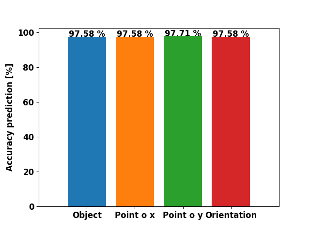
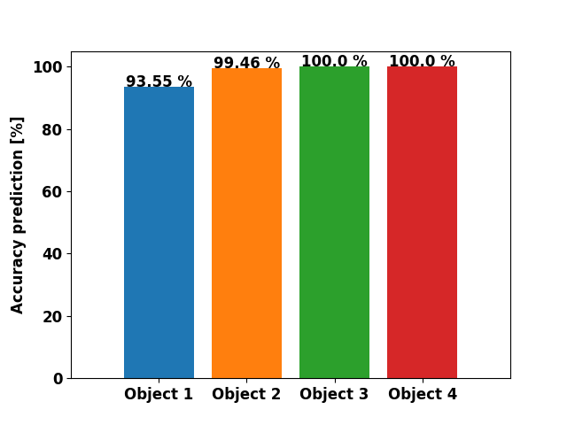

# AAS-Final-Project

**By Dennis Jensen s155629, Martin Jensen s164033, Theis Munk Jensen s164022, & Stefan M. Carius Larsen s164029** \
This notebook gives a quick introduction for installation of our code and gives a quick display of the results that was achieved. The project had three main coding challenges: SMR-CL implementation (Making the simulation drive using Kalman filter and graph planning algorithm), C++ with object detection, and automated pipeline written in python in order to create data for statistical analysis and dependability.

##  Getting started
**This github repository was created for the purpose of DTU course 31388 and contains all files needed to run the solution of the final project, including:**
- MRC script
- ulmsserver.ini
- Simconfig.xml for the simulator
- wallfile for the course
- sourcecode for plugins
- runable modules for plugins

## Automated pipeline -- Understanding it --
**In order to run the automated simulation, a quick introduction is given**\
The file "automated_object_detection_test.py" will generate a random position for the object, that the SMR has to find. The simulator will in the first simulation create object 1 with random position and orientation and it will run to all guidemarks, find the object and go back to start whereafter it will terminate and start again. Second runthrough it will create object 2, next object 3 and lastly object 4, all with random pose. This process will keep iterating until it is stopped.\
When running the automated pipeline, it will initiate a couple of different programs.  
- **ulmsserver.ini**
- The simserver renamed to **automateEnvironment.xml**
- The .xml file will contain a wall file **388auto**, which is randomly generated. 
- Runs the mrc script by the command: **mrc -s8000 final_project_final**

## Setup guide
Setup is very easy. Simply download or clone the repository to the robot environment home directory.\
Install python3 (atleast version 3.6.9) in the environment and install numpy.
Go into the folder **AAS-Final-Project** in the terminal, write "./setup_object_detect.sh" and the new/modified plugins will compile.\
Lastly, type "python3 automated_object_detection_test.py" and the program will run.

## Results
Results created from automated pipeline. The table show the number of simuations executed and their corresponding results:\

| **Runs**        | **Number**  | **Success** | **Fails** |
| ---         |  ---    |  ---    | ---   |
| **All Objects** | 738     | 725     | 13    |
| **Object 1**    | 186     | 174     | 12    |
| **Object 2**    | 184     | 183     | 1     |
| **Object 3**    | 184     | 184     | 0     |
| **Object 4**    | 184     | 184     | 0     |

First image show the success for correct detection of object, point o in x, point o in y, and orientation. Second image show classification successrate for all four objects.\
  

